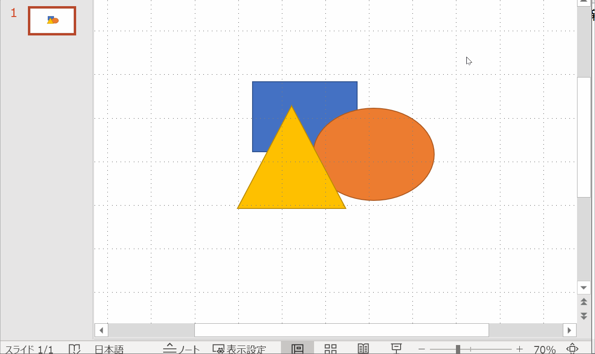

# Kuroko

Kuroko is a small tool to convert from EMF to PDF.

* It captures EMF data in a clipboard and converts it to PDF.
* In a similar way as [MetafileToEPSConverter](https://wiki.lyx.org/Windows/MetafileToEPSConverter), which makes EPS files, you can make PDF files from pictures on MS Power Point/Excel.
* Kuroko can run only on Windows 10, because it relies on "Microsoft Print to PDF" printer.
* It relies on a small command line tool [Kuroko-CLI](https://github.com/shioyadan/kuroko-cli).




## How to build

* Install the following:
    * cygwin & GNU Make
    * node.js
    * Visual Studio Build Tools 2019 - C++ Build Tools 
* Run these commands in cygwin.
    ```
    make init 
    make run   # Launch kuroko directly 
    make pack  # Build a release binary
    ```


## License

Copyright (C) 2020 Ryota Shioya <shioya@ci.i.u-tokyo.ac.jp>
This application is released under the 3-Clause BSD License, see LICENSE.md. This application bundles Kuroko-CLI (https://github.com/shioyadan/kuroko-cli).
This application also bundles ELECTRON and many third-party packages in accordance with the licenses presented in THIRD-PARTY-LICENSES.md.
